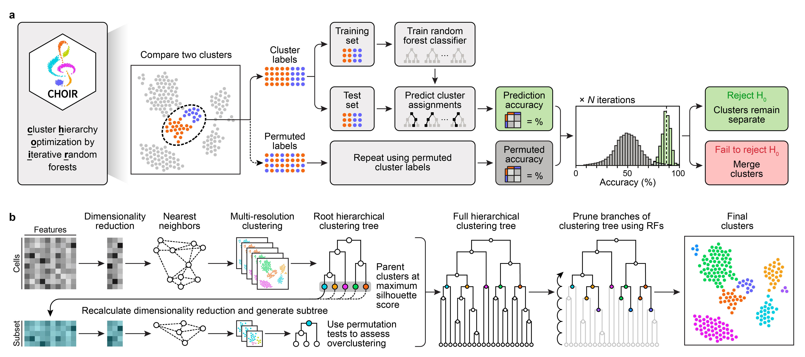

# CHOIR improves significance-based detection of cell types and states from single-cell data

# Brief descriptions of analysis scripts

## Pre-processing pipeline (See `preprocessing_scripts` folder)

This folder contains code to run a standardized pre-processing pipeline that was used to perform read alignment, quality control, and normalization steps on the datasets used in the benchmarking assessments.

## Clustering methods (See `clustering_scripts` folder)

This folder contains code to run 15 different clustering methods, including CHOIR, using a series of parameter combinations, and compiles the resulting cluster labels, computational time, and memory usage.

## Benchmarking analysis for simulated datasets (See `additional_analysis_scripts/simulated_datasets` folder)

**generate_simulated_data.R** - Code to generates the simulated datasets for clustering method benchmarking using Splatter.

**simulated_data_metrics.R** - Code to assesses benchmarking metrics for the clustering of each simulated dataset.

**simulated_data_plots.R** - Code to generate plots for the analysis of the simulated datasets. See Supplementary Fig. 2–21.

**simulated_data_compiled_metrics.R** - Code to compiles benchmarking metrics across the 100 simulated datasets. See Fig. 2 and Extended Data Fig. 2.

**run_subclustering.R** - Code to run the subclustering analysis on Simulated Datasets 46–50. See Supplementary Fig. 22.

**subclustering_analysis_metrics.R** - Code to assesses the benchmarking metrics for the subclustering analysis of Simulated Datasets 46–50. See Supplementary Fig. 22.

## Benchmarking analysis for real single-cell sequencing datasets (See `additional_analysis_scripts/real_datasets` folder)

**Wang_2022_10x_Multiome_human_retina.R** - Code to analyze and generate plots for the Wang et al. 2022 10x Multiome human retina dataset. See Extended Data Fig. 1–2.

**Kinker_2020_cancer_cell_lines.R** - Code for the benchmarking analysis of the Kinker et al. 2020 scRNA-seq cancer cell line dataset. See Fig. 3, Extended Data Fig. 2, and Supplementary Fig. 23.

**Hao_2021_CITEseq_human_PBMCs.R** - Code for the benchmarking analysis of the Hao et al. 2021 CITE-seq human PBMC dataset. See Fig. 4, Extended Data Fig. 2, and Supplementary Fig. 24.

**Srivatsan_2021_sciSpace_mouse_embryo.R** - Code for the benchmarking analysis of the Srivatsan et al. 2021 sci-Space mouse embryo dataset. See Fig. 5, Extended Data Fig. 2–3, and Supplementary Fig. 25–29.

**MAGIC_imputation.R** - Code to run MAGIC imputation for selected genes.

# Data availability

## Simulated datasets generated using R package Splatter

**Simulated Datasets 1–100** - https://files.corces.gladstone.org/Publications/2024_Petersen_CHOIR

## Publicly available datasets used in the benchmarking assessments

**Wang et al. 2022 10x Multiome human retina data** - GEO accession number: [GSE196235](https://www.ncbi.nlm.nih.gov/geo/query/acc.cgi?acc=GSE196235)

**Kinker et al. 2020 scRNA-seq cancer cell line data** - GEO accession number: [GSE157220](https://www.ncbi.nlm.nih.gov/geo/query/acc.cgi?acc=GSE157220)

**Yang et al. 2021 scRNA-seq A375 cancer cell line data** - GEO accession number: [GSE164614](https://www.ncbi.nlm.nih.gov/geo/query/acc.cgi?acc=GSE164614)

**Dave et al. 2023 scRNA-seq T47D cancer cell line data** - GEO accession number: [GSE182694](https://www.ncbi.nlm.nih.gov/geo/query/acc.cgi?acc=GSE182694)

**Hao et al. 2021 CITE-seq human PBMC data** - GEO accession number: [GSE164378](https://www.ncbi.nlm.nih.gov/geo/query/acc.cgi?acc=GSE164378)

**Srivatsan et al. 2021 sci-Space whole mouse embryo data** - GEO accession number: [GSE166692](https://www.ncbi.nlm.nih.gov/geo/query/acc.cgi?acc=GSE166692)

**Note 1.** File paths in some of the provided scripts are hard-coded.